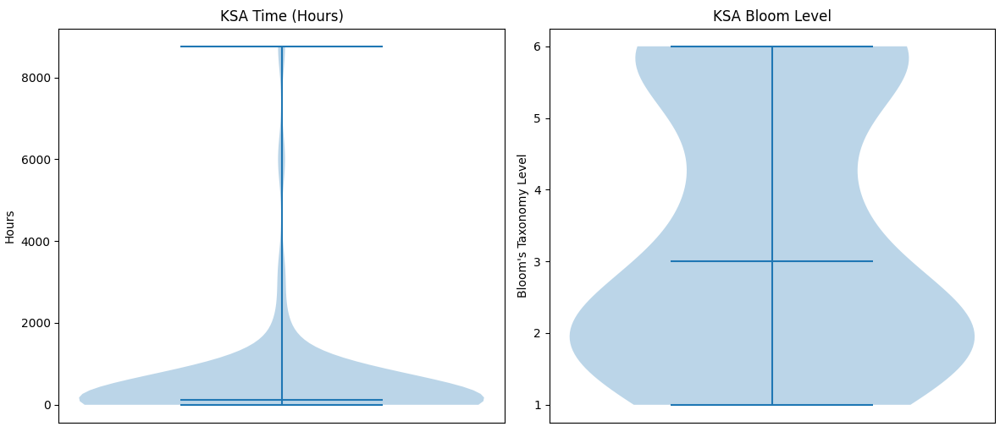

The concept of rigor in training and education can be surprisingly complex and difficult for an organization to get
right. This introduction to the topic focuses on how a specific stated learning objective's rigor can be measured using
estimates for total hours to complete the goal and its alignment to Bloom's Taxonomy of Learning. A more detailed
explanation of the concepts discussed can be found in the whitepaper in the github project listed in the "Related links"
section of this page.

<!-- more -->

!!! Info "Definition of Rigorous"

    **adjective**

    1. characterized by rigor; rigidly severe or harsh, as people, rules, or discipline.
    **Synonyms**: unyielding, stiff, inflexible, hard, austere, stern

    2. severely exact or accurate; precise.
    **Synonyms**: finical, demanding
    **Antonyms**: inaccurate

    3. Logic, Mathematics.,  logically valid.

## Logistical Rigor
**Logistical Rigor** in training is created when artificial time pressure, overly strict policies, unnecessarily large
numbers of repetitions, and similar techniques are used by those who created and run the training. Logistical rigor
should generally be avoided unless discovering how individuals deal with the pressure of these training techniques is
the goal of the training.

For example, the U.S. Army Ranger School routinely imposes strict limitations on the food and sleep trainees
receive. The intention is to emulate austere military missions so trainees and instructors can discover how the trainees
react and endure in the presence of hardship; how they react to logistical rigor.

!!! Idea "Examples of Logistical Rigor"

    * Do 10,000 pushups
    * Draw a perfect circle freehand
    * Complete 400 addition problems
    * Answer each short answer question in 15 seconds or less

## Cognitive Rigor
**Cognitive Rigor** encourages learners to think critically, creatively, and flexibly; to question
their prior assumptions; and to engage with material that is sophisticated, complex, ambiguous, or contentious. Cognitive
rigor is not the cause of difficult work but rather the _result_ of work that challenges a student's thinking
in new and interesting ways. It is measured in the depth of understanding achieved, not the quantity of work completed.

!!! Idea "Examples of Cognitive Rigor"

    * Accurately explain how muscles work in a manner appropriate for a 5-year old, a high school graduate, and a surgeon

    * Demonstrate and explain how a car's engine works

    * Calculate the fuel needed to launch a rocket from Earth so it enters orbit around Mars

## Estimating the Logistical and Cognitive Rigor of Learning Objectives

!!! info inline end "Example Algebra Learning Objective"

    Determine if a given number is a solution to an equation or inequality.

For formal institutional training with hundreds or thousands of learners, training is often structured as a series of
classes, courses, certificates, or similar collections of related **learning objectives**. For example, an "algebra I"
class in a high school might include the following learning objective. Without any further information or measurements
from how long prior students take to master (or fail to master) the learning objective, we can make rough estimates about
the learning objective's logistic and cognitive rigor.

### Estimating Logistic Rigor with Time Estimates
Experts in the topic being trained can estimate how much time they expect students to need to complete a learning objective.
Another modern approach to making this estimate is asking a large language model (LLM) artificial intelligence (AI) to
make the estimate. Either way, the estimated time to complete the learning objective can give us an initial idea about the
logistical rigor. If our learning objective is "apply critical thinking" and the LLM estimates several years are needed
to master the learning objective, the training developers may want to reconsider whether the course is intended to take
several years. If not, rewriting the learning objective to more accurately meet the course's intended scope may be needed.

### Estimating Cognitive Rigor with Bloom's Taxonomy of Learning
Not all learners are at the same level of proficiency in a particular topic. The cognitive differences between a novice
and an expert are not merely quantitative (i.e., the expert knows more); they are qualitative, reflecting fundamental
shifts in how knowledge is structured, accessed, and applied. Understanding these shifts is important for designing and
evaluating learning objectives that are appropriately rigorous at each stage.

Academic education makes this distinction through the concepts of elementary school, middle school, high school, and
increasingly 'rigorous' college degrees from associates, bachelors, masters, and finally doctoral degrees. A learning
objective appropriately cognitively rigorous for a 3rd grader would not be appropriate for college graduate students.
Likewise, asking the 3rd grader to write and defend a Ph.D. dissertation is unrealistic. Vocational training follows a
similar trend with tiered levels of competency given different names such as Basic, Senior, and Master qualification levels.

<figure markdown="span">
  
  <figcaption>Bloom's Taxonomy of Learning <a href="https://helpfulprofessor.com/levels-of-understanding/">Infographic by HelpfulProfessor.com</a>
  </figcaption>
</figure>

The "Related links" section of this page includes more information on Bloom's Taxonomy of Learning. The general idea is
learning objectives at the novice/basic level should best match the cognitive rigor described in the lower levels of
Bloom's Taxonomy: remember and apply. Can the basic learner simply recall and understand facts they are given? As a
learner establishes proficiency and moves towards mastery, the learning objectives they're asked to complete should
"move up" Bloom's Taxonomy ending with tasks asking the learner to create fundamentally new ideas and things.

As with time estimates, either human experts, an LLM AI, or both working together can be used to create initial estimates
of which level of Bloom's Taxonomy of Learning a particular learning objective most relates to. If a learning objective
in a course designed for basic learners is assessed as being very high in Bloom's Taxonomy (evaluate, create), the course
developer may want to reconsider whether it is appropriate for that level of learners. A "remember" or "understand" aligned
learning objective in a qualification intended for experts may also not be appropriate as it's unlikely to be a good use
of the time set aside for them to learn new things.

## Bringing it all Together: Curriculum and Qualification Design
Once estimates for the logistical and cognitive rigor for each learning objective in a course or qualification are
complete, it's possible for the training developers to assess whether their training program appropriately assists
learning in progressing from basic, senior, and finally master/expert mastery of a topic. The majority of learning
objectives given to basic/novice learners should be "lower" in Bloom's Taxonomy of Learning: Remember, Understand, and
Apply. Master/expert learners should be asked to focus on more abstract tasks: create, evaluate, and analyze. Senior or
intermediate learners should be asked to take on learning goals that begin to transition recalling facts identified by
others and develop their own original but well considered ideas: apply and analyze learning objectives.

Additionally, it's important to identify and eliminate unnecessary logistic rigor. Let's return to the earlier example of
the learning objective "apply critical thinking" with an LLM AI estimating several years to complete. Its important that
curriculum developers select learning objectives that are appropriately specific and don't impose an excessive time
commitment from students. Learning objectives with high time estimates should probably be eliminated or rewritten regardless
of whether their cognitive rigor is appropriate for the learner's level of expertise.

### Visualizing Rigor Estimates
Once curriculum develops understand how to 'read' violin plots of the estimated completion time and Bloom's Taxonomy
level for each learning objective (aka Knowledge, Skill, or Ability) developed in their course or qualification, they
can quickly assess whether they've appropriately created a series of increasingly difficult tiers of learning.

In the example above, we can make a couple key observations about whether the curriculum is well designed:

* Most learning objectives (KSAs) are less than a couple of days. However, there's several objectives which are
estimated to take thousands of hours. We may want to revisit which learning objectives those are and assess if they
should be rewritten.

* The learning objectives represent a mix of cognitive rigor. This may be appropriate for an intermediate/senior or
expert/master level learner. However, if this course or qualification is intended for beginner/basic learners, it's
probably not appropriate to have so many outcomes at the analyze, evaluate, and create levels of abstract learning.

## Conclusion
Estimates for the time and alignment in Bloom's Taxonomy of Learning for each learning objective in a course or qualification
can help us ensure learners effectively transition from novice/basic to expert/master levels of competence. Large language
models (LLMs) can help us quickly and automatically make these estimates if we don't already have data from previous
learners to inform the analysis. Further information on these ideas are available in the "Related links" section of this
page and the whitepaper available for download from the linked GitHub repository.
